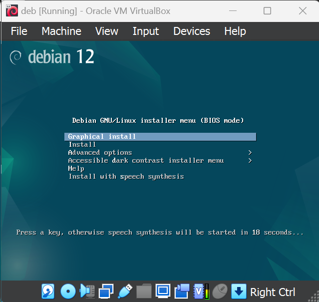

**Laporan Tugas 1**

**Workshop Administrasi Jaringan**

{width="5.921606517935258in"
height="5.624744094488189in"}

Oleh :

> Nama : Mohammad Ilham Ramadani
>
> Kelas : D3 IT A
>
> NRP : 3122500021
>
> Dosen Pengampu : Dr. Ferry Astika Saputra ST, M.Sc

1.  Buatlah tulisan tentang langkah-langkah instalasi sistem operasi
    Debian. Anda bisa menggunakan aplikasi virtualisasi seperti
    VirtualBox, VMWare Player, Vmware Fusion (MAC), dls. Kebutuhan
    sistem adalah sebagai berikut :

    -   CPU : 2 core

    -   RAM : 4096 (min)

    -   HDD : 25 GB dengan partisi :

        -   / : 20 GB

        -   /storage : 5 GB

        -   swap : 1,5 GB

        -   Hostname : SysAdmin-NRP

[Jawab :]{.mark}

1\. Masuk alamat website berikut : [[Debian \-- Downloading
Debian]{.underline}](https://www.debian.org/download)

{width="4.953125546806649in"
height="2.641117672790901in"}

2\. Click tombol new untuk menambahkan iso yang sudah didownload

{width="4.838542213473316in"
height="2.379083552055993in"}

> 3\. Beri nama kemudian taruh di path sesuai yang diinginkan dan pilih
> folder dimana kita akan menaruh VDI (Virtual Disk Image) nanti.

{width="5.131767279090114in"
height="2.8963385826771653in"}

> 4\. Atur penggunaan core processor, RAM, dan penggunaan storage sesuai
> dengan spesifikasi PC Anda.

{width="5.225517279090114in"
height="2.957075678040245in"}

{width="5.2817804024496935in"
height="2.9843755468066493in"}

> 5\. Tekan start, lalu setelah muncul window untuk menginsert ISO,
> pilihlah ISO Debian yang sudah didownload.
>
> {width="5.41042760279965in"
> height="2.5970056867891516in"}{width="5.401042213473316in"
> height="3.122477034120735in"}
>
> 7\. Pilih *Graphical Install,* pilih bahasa, lokasi, dan bahasa
> keyboard. Lalu enter.

{width="4.038017279090114in"
height="3.5568908573928257in"}

8\. Pilih bahasa sesuai preferensi anda

{width="5.411458880139983in"
height="4.606123140857393in"}

{width="5.07502624671916in"
height="4.619792213473316in"}{width="5.1551279527559055in"
height="4.692708880139983in"}

9\. Tunggu proses Instalasi selesai

{width="4.822916666666667in"
height="4.152099737532809in"}

10\. Atur hostname yang nanti digunakan untuk sistem

{width="4.897391732283465in"
height="4.511054243219598in"}

11\. Setting juga user dan password untuk root serta account untuk sign
in

> {width="5.223958880139983in"
> height="4.462987751531059in"}
>
> {width="5.338542213473316in"
> height="4.571510279965004in"}

{width="5.027600612423447in"
height="4.337723097112861in"}

12\. Setting jam yang sesuai dengan lokasi anda.

{width="5.338542213473316in"
height="4.612342519685039in"}

> 13\. Bagi partisi disk sesuai dengan kebutuhan sistem dan ikuti
> langkah berikut. HDD : 25 GB dengan partisi :

-   / : 20 GB

-   /storage : 5 GB

-   swap : 1,5 GB

{width="4.616141732283465in"
height="3.950657261592301in"}{width="4.689058398950131in"
height="4.040671478565179in"}{width="4.959891732283465in"
height="4.498972003499563in"}{width="5.064058398950131in"
height="4.56464457567804in"}{width="5.235933945756781in"
height="4.533055555555555in"}{width="5.288017279090114in"
height="4.550154199475066in"}{width="5.340100612423447in"
height="4.531923665791776in"}{width="5.413017279090114in"
height="4.641198600174978in"}{width="5.364583333333333in"
height="4.572916666666667in"}{width="5.416666666666667in"
height="4.6521806649168855in"}{width="5.535441819772529in"
height="4.755208880139983in"}{width="5.522391732283465in"
height="4.751107830271216in"}{width="5.543225065616798in"
height="4.75133530183727in"}{width="5.34375in"
height="4.583333333333333in"}{width="5.302083333333333in"
height="4.53125in"}{width="5.40625in"
height="4.6209306649168855in"}{width="5.447916666666667in"
height="4.677083333333333in"}{width="5.466205161854768in"
height="4.682292213473316in"}{width="5.407808398950131in"
height="4.668011811023622in"}

{width="5.375in" height="4.579263998250219in"}

{width="5.470308398950131in"
height="4.659160104986877in"}

14\. Tunggu proses install base system selesai

{width="5.203125546806649in"
height="3.60415791776028in"}

15\. Kemudian ikuti langkah berikut untuk configure the package manager

{width="5.210378390201225in"
height="4.417724190726159in"}

{width="5.282808398950131in"
height="4.54709864391951in"}

> {width="5.246350612423447in"
> height="4.742700131233596in"}
>
> {width="5.261975065616798in"
> height="4.751407480314961in"}{width="5.227968066491688in"
> height="4.776042213473316in"}{width="5.183850612423447in"
> height="4.720253718285214in"}

16\. Saat Configuring popularity-content bisa diskip, dengan memilih no

> {width="5.095548993875766in"
> height="4.319905949256343in"}

17\. Pilih poin 1, 2 dan yang terakhir untuk saat memilih menginstall
software

> {width="5.703125546806649in"
> height="4.869445538057743in"}{width="5.760416666666667in"
> height="3.3645833333333335in"}
>
> 18\. Saat proses instalasi selesai reboot dan anda pilih Debian untuk
> mulai menggunakannya.
>
> {width="5.744792213473316in"
> height="4.952735126859142in"}
>
> 19\. Debian sudah terinstall dan login menggunakan password yang tadi
> sudah di setting sebelumnya

{width="4.506767279090114in"
height="3.3367410323709534in"}

> 20\. Anda sudah bisa menggunakan debiannya dan jangan lupa untuk log
> out selesai menggunakannya

{width="5.459891732283465in"
height="3.8964326334208224in"}

{width="5.553641732283465in"
height="2.943733595800525in"}

> 21\. Anda juga bisa menggunakannya lagi dengan hanya mengklik start,
> kemudian akan tergenerate bios, lalu setelahnya login seperti biasa

{width="5.484375546806649in"
height="2.660194663167104in"}

2.  Buat ringkasan tentang perbedaan dari Debian 12 (bookworm) dengan
    Debian 11 (bullseye) : versi kernel, kebutuhan sistem, penerapan
    systemd dan perbedaan packagenya (dalam bentuk tabel) !

[Jawab :]{.mark}

+-----------------------+----------------------+----------------------+
| Kategori              | Debian 11            | Debian 12            |
+=======================+======================+======================+
| Versi kernel          | Kernel linux 5.1     | Kernel linux 6.1     |
+-----------------------+----------------------+----------------------+
| Kebutuhan sistem      | -   CPU : 1 core     | -   CPU : 2 core     |
|                       |                      |                      |
|                       | -   RAM : 512 (min)  | -   RAM : 4096 (min) |
|                       |                      |                      |
|                       | -   HDD : 10 GB      | -   HDD : 25 GB      |
+-----------------------+----------------------+----------------------+
| Penerapan systemd     | Menggunakan version  | Menggunakan version  |
|                       | [247]{.mark}         | [252]{.mark}         |
+-----------------------+----------------------+----------------------+
| Perbedaan package     | -   [Apache          | -   [Apache          |
|                       |     2.4.54]{.mark}   |     2.4.547]{.mark}  |
|                       |                      |                      |
|                       | -   [Bash            | -   [Bash            |
|                       |     5.1]{.mark}      |     5.15]{.mark}     |
|                       |                      |                      |
|                       | -   [BIND DNS Server | -   [BIND DNS Server |
|                       |     9.16]{.mark}     |     9.18]{.mark}     |
|                       |                      |                      |
|                       | -   [Cryptsetup      | -   [Cryptsetup      |
|                       |     2.3]{.mark}      |     2.6]{.mark}      |
|                       |                      |                      |
|                       | -   [Emacs           | -   [Emacs           |
|                       |     27.1]{.mark}     |     28.2]{.mark}     |
|                       |                      |                      |
|                       | -   [Exim default    | -   [Exim default    |
|                       |     e-mail server    |     e-mail server    |
|                       |     4.94]{.mark}     |     4.96]{.mark}     |
|                       |                      |                      |
|                       | -   [GNU Compiler    | -   [GNU Compiler    |
|                       |     Collection as    |     Collection as    |
|                       |     default compiler |     default compiler |
|                       |     10.2]{.mark}     |     12.2]{.mark}     |
|                       |                      |                      |
|                       | -   [GIMP            | -   [GIMP            |
|                       |     2.10.22]{.mark}  |     2.10.34]{.mark}  |
|                       |                      |                      |
|                       | -   [GnuPG           | -   [GnuPG           |
|                       |     2.2.27]{.mark}   |     2.2.40]{.mark}   |
|                       |                      |                      |
|                       | -   [Inkscape        | -   [Inkscape        |
|                       |     1.0.2]{.mark}    |     1.2.2]{.mark}    |
|                       |                      |                      |
|                       | -   [the GNU C       | -   [the GNU C       |
|                       |     library          |     library          |
|                       |     2.31]{.mark}     |     2.36]{.mark}     |
|                       |                      |                      |
|                       | -   [Linux kernel    | -   [Linux kernel    |
|                       |     image 5.10       |     image 6.10       |
|                       |     series]{.mark}   |     series]{.mark}   |
|                       |                      |                      |
|                       | -   [LLVM /Clang     | -   [LLVM /Clang     |
|                       |     toolchain 9.0.1  |     toolchain 13.0.1 |
|                       |     and 11.0.1       |     and 14.0         |
|                       |     (default) and    |     (default) and    |
|                       |     13.0.1]{.mark}   |     15.0.6]{.mark}   |
|                       |                      |                      |
|                       | -   [MariaDB         | -   [MariaDB         |
|                       |     10.5]{.mark}     |     10.11]{.mark}    |
|                       |                      |                      |
|                       | -   [Nginx           | -   [Nginx           |
|                       |     1.18]{.mark}     |     1.22]{.mark}     |
|                       |                      |                      |
|                       | -   [OpenJDK         | -   [OpenJDK         |
|                       |     11]{.mark}       |     17]{.mark}       |
|                       |                      |                      |
|                       | -   [OpenLDAP        | -   [OpenLDAP        |
|                       |     2.4.57]{.mark}   |     2.5.13]{.mark}   |
|                       |                      |                      |
|                       | -   [OpenSSH         | -   [OpenSSH         |
|                       |     8.4p1]{.mark}    |     9.2p1]{.mark}    |
|                       |                      |                      |
|                       | -   [OpenSSL         | -   [OpenSSL         |
|                       |     1.1.1n]{.mark}   |     3.0.8]{.mark}    |
|                       |                      |                      |
|                       | -   [Perl            | -   [Perl            |
|                       |     5.32]{.mark}     |     5.36]{.mark}     |
|                       |                      |                      |
|                       | -   [PHP 7.4]{.mark} | -   [PHP 8.2]{.mark} |
|                       |                      |                      |
|                       | -   [Postfix MTA     | -   [Postfix MTA     |
|                       |     3.5]{.mark}      |     3.7]{.mark}      |
|                       |                      |                      |
|                       | -   [PostgreSQL      | -   [PostgreSQL      |
|                       |     13]{.mark}       |     15]{.mark}       |
|                       |                      |                      |
|                       | -   [Python 3        | -   [Python 3        |
|                       |     3.9.2]{.mark}    |     3.11.2]{.mark}   |
|                       |                      |                      |
|                       | -   [Rustc           | -   [Rustc           |
|                       |     1.48]{.mark}     |     1.63]{.mark}     |
|                       |                      |                      |
|                       | -   [Samba           | -   [Samba           |
|                       |     4.13]{.mark}     |     4.17]{.mark}     |
|                       |                      |                      |
|                       | -   [Systemd         | -   [Systemd         |
|                       |     247]{.mark}      |     252]{.mark}      |
|                       |                      |                      |
|                       | -   [Vim 8.2]{.mark} | -   [Vim 9.0]{.mark} |
+-----------------------+----------------------+----------------------+

3.  Jelaskan fungsi dari file \"/etc/groups\" beserta formatnya!

[Jawab :]{.mark}

{width="6.267716535433071in"
height="2.0277777777777777in"}

{width="6.267716535433071in"
height="0.19444444444444445in"}

{width="6.267716535433071in"
height="4.708333333333333in"}

{width="6.267716535433071in"
height="4.722222222222222in"}

{width="6.267716535433071in"
height="4.666666666666667in"}

{width="6.267716535433071in"
height="4.527777777777778in"}

{width="6.267716535433071in"
height="4.722222222222222in"}

Langkah-langkah diatas adalah cara untuk menambahkan user dan memasukkan
pada /etc/group. Fungsi utamanya adalah memetakan ID grup ke nama grup
dan menyertakan daftar pengguna yang termasuk dalam setiap grup
tersebut. Format file /etc/group pada Debian adalah sebagai berikut :

nama_grup:password:ID_grup:daftar_pengguna

-   nama_grup: Nama grup pengguna.

-   password: Umumnya, kolom ini diisi dengan karakter \"x\".
    Sebelumnya, kata sandi grup disimpan di sini, tetapi sekarang
    umumnya disimpan di file /etc/gshadow.

-   ID_grup: Nomor identifikasi unik untuk grup.

-   daftar_pengguna: Daftar pengguna yang termasuk dalam grup,
    dipisahkan oleh koma.

4.  Jelaskan perbedaan penggunaan perintah \"su\" dengan \"su -\"!

[Jawab :]{.mark}

{width="6.270833333333333in"
height="1.842101924759405in"}

> Dalam perintah su atau *switch user*, kita akan berpindah user tanpa
> berpindah environment variable dan working directory. Sedangkan su -
> kita akan berpindah sekaligus dengan shell variablenya. Sehingga kita
> akan seolah-olah login dengan user yang baru.
>
> Dibawah ini bisa terlihat working directory dari setiap command.
> Terlihat bahwa command sudo, working directorynya tetap di home dari
> user yang Anda gunakan, namun ketika menggunakan command sudo -,
> working directorynya akan berbeda.
>
> {width="4.921875546806649in"
> height="3.7036701662292213in"}

5.  Jelaskan fungsi dari \"sudo\" !

[Jawab :]{.mark}

{width="6.267716535433071in"
height="1.7916666666666667in"}

{width="6.267716535433071in"
height="3.7777777777777777in"}

> Sudo atau *superuser do* adalah command pada sistem Linux dan Unix
> untuk memberikan izin root kepada pengguna biasa untuk menjalankan
> perintah yang hanya bisa diakses ketika menjadi superuser. Dengan
> command ini, admin dapat membuat user melakukan command khusus tanpa
> harus memberi akses menjadi superuser.

6.  Jelaskan langkah-langkah penambahan user anda sebagai user sudo !
    Gunakan perintah \"su -\" lalu setelah masuk sebagai root, jalankan
    perintah \"visudo\". Tambahkan user anda di bawah user root pada
    bagian \" \# User privilege specification\"

[Jawab :]{.mark}

langkah - langkah :

1.  Masuk terminal seperti biasa dan ketik "su -", tanpa tanda petik.

2.  Masukkan password anda yang anda gunakan sebagai root

3.  Ketik visudo untuk menambahkan root anda agar bisa login sudo

4.  Kemudian scroll sampai ketemu dengan #User privilege specification,
    lalu tambahkan user anda dan sesuaikan dengan format root diatas.

5.  Setelah selesai save dengan ctrl + o dan juga exit dengan ctrl + x

6.  Dan yang terakhir exit untuk keluar dari mode root dan cek dengan
    "sudo apt update" dan jika berhasil update maka penambahan user
    sebagai user sudo sudah selesai.

> {width="5.401042213473316in"
> height="2.4467125984251967in"}
>
> {width="5.423929352580927in"
> height="4.06007874015748in"}
