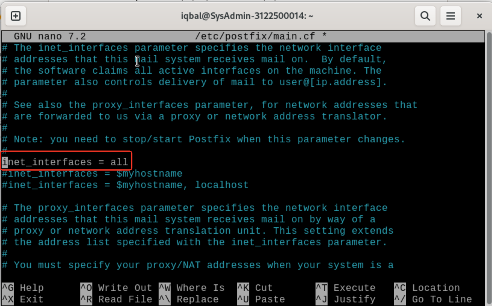

**LAPORAN WORKSHOP ADMINISTRASI JARINGAN**

**  
**

**Disusun Oleh:**

**Muhammad Iqbal Rahmatullah D3 IT A /3122500014**

**Mohammad Ilham Ramadani D3 IT A /3122500021**

**Rifqi Rayita Dhiyaulhaq D3 IT A /3122500027**

**Dosen Pembimbing :**

**Dr. Ferry Astika Saputra ST, M.Sc**

#### Melakukan install NTP Client

1.  Lakukan instalasi paket layanan sinkronisasi waktu → sudo apt
    install systemd-timesyncd

> 
>
> Perintah untuk menginstal paket systemd-timesyncd, yang merupakan
> bagian dari systemd dan digunakan untuk sinkronisasi waktu pada sistem
> Linux.

2.  Melakukan konfigurasi timezone ke Asia/Jakarta → sudo timedatectl
    set-timezone Asia/Jakarta

> 
>
> Command di atas digunakan untuk mengatur zona waktu menjadi
> Asia/Jakarta. Ini memastikan bahwa sistem menggunakan zona waktu yang
> benar.

3.  Melakukan konfigurasi Real Time Clock (RTC) untuk merefer ke UTC
    (Coordinated Universal Time) → sudo timedatectl set-local-rtc false

> 
>
> Perintah ini mengatur RTC (Real-Time Clock) untuk tidak menggunakan
> waktu lokal. Ini umumnya disarankan untuk sistem yang dual-boot dengan
> Windows, yang biasanya menggunakan RTC lokal.

4.  Mengaktifkan NTP Client untuk sinkronisasi waktu → sudo timedatectl
    set-ntp true

> 
>
> Perintah ini digunakan untuk mengaktifkan sinkronisasi waktu
> menggunakan NTP (Network Time Protocol), yang memungkinkan sistem
> untuk menyesuaikan waktu secara otomatis dengan server waktu
> eksternal.

5.  Menyunting file timesyncd.conf untuk mengarah ke NTP server terdekat
    untuk mendapatkan waktu delay terpendek. Biasanya setiap organisasi
    atau negara mempunyai NTP Server sendiri → sudo nano
    /etc/systemd/timesyncd.conf

> 
>
> Command ini membuka file konfigurasi systemd-timesyncd menggunakan
> editor nano. Atur value dari NTP, NTP=0.id.pool.ntp.org.

6.  Restart layanan sinkronisasi waktu dan pastikan layanan berjalan
    dengan benar

> sudo systemctl restart systemd-timesyncd
>
> 
>
> Perintah ini digunakan untuk me-restart systemd-timesyncd setelah
> mengubah konfigurasinya. Ini memastikan bahwa perubahan konfigurasi
> diterapkan.
>
> sudo systemctl status systemd-timesyncd
>
> 
>
> Perintah ini digunakan untuk memeriksa status systemd-timesyncd
> setelah restart. Ini berguna untuk memastikan bahwa layanan telah
> dimulai kembali tanpa masalah.
>
> Dapat dilihat status active(running)

7.  Lakukan pengecekan kesesuaian tanggal system dengan perintah →
    timedatectl

> 
>
> Command ini digunakan untuk menampilkan informasi waktu dan tanggal
> saat ini, serta pengaturan zona waktu dan sinkronisasi waktu lainnya.

8.  Melihat hasil dengan sudo timedatectl
    timesync-status

> 
>
> Perintah di atas digunakan untuk memeriksa status sinkronisasi waktu.
> Ini memberikan informasi tentang apakah sinkronisasi waktu sedang
> aktif atau tidak. Tujuan dari konfigurasi di atas adalah untuk
> mengatur dan mengonfigurasi waktu dan sinkronisasi waktu pada sistem
> Linux menggunakan systemd-timesyncd dan timedatectl.

#### Apache 2 + PHP-FM

1.  Install Apache2 → sudo apt -y install apache2

> 
>
> Command ini digunakan untuk menginstal server web Apache HTTP. Opsi -y
> memungkinkan instalasi untuk berjalan tanpa interaksi pengguna dengan
> menyetujui semua pertanyaan konfirmasi.

2.  Melakukan konfigurasi Apache2

- sudo nano /etc/apache2/conf-enabled/security.conf

> 
>
> Perintah ini membuka file konfigurasi security.conf dari Apache
> menggunakan editor nano. Tujuannya adalah untuk mengonfigurasi
> pengaturan keamanan untuk server web Apache, seperti mengaktifkan atau
> menonaktifkan modul keamanan atau menetapkan kebijakan keamanan.
> Tambakan ServerTokens Prod dibawah baris \#ServerTokens Minimal.

- sudo nano /etc/apache2/mods-enabled/dir.conf

> 
>
> Command ini membuka file konfigurasi dir.conf dari Apache menggunakan
> editor nano. Tujuannya adalah untuk mengonfigurasi bagaimana Apache
> akan menangani permintaan direktori default, yaitu dalam urutan file
> apa yang akan disajikan ketika direktori tersebut diakses. Ubah baris
> value command menjadi “DirectoryIndex index.html index.htm”.
>
> 
>
> Dengan hal yang sama ubah baris value command menjadi “DirectoryIndex
> index.html index.htm index php”.

- sudo nano /etc/apache2/apache2.conf

> 
>
> Command ini membuka file konfigurasi utama apache2.conf dari Apache
> menggunakan editor nano. Tujuannya adalah untuk mengonfigurasi
> pengaturan umum untuk server web Apache, seperti pengaturan server,
> modul yang dimuat, dan pengaturan lainnya. Tambahkan spesifikasi nama
> server menjadi ServerName www.kelompok6.local

- sudo nano /etc/apache2/sites-enabled/000-default.conf

> 
>
> Command ini membuka file konfigurasi 000-default.conf dari Apache
> menggunakan editor nano. Ini adalah konfigurasi situs default yang
> digunakan oleh Apache. Tujuannya adalah untuk mengonfigurasi
> pengaturan situs default, seperti alamat root dokumen, log, dan
> pengaturan lainnya. Ubah bagian webmaster's email menjadi “ServerAdmin
> webmaster@kelompok6.local”.

- systemctl reload apache2

> 
>
> Perintah ini untuk me-reload konfigurasi Apache tanpa memulai ulang
> layanan. Tujuannya adalah agar perubahan konfigurasi yang dilakukan
> pada langkah-langkah sebelumnya diterapkan tanpa memengaruhi
> ketersediaan layanan web.

3.  Melakukan test ke web browser

> 
>
> Lakukan test langsung ke web browser dengan cara memasukkan alamat
> domain local dari konfigurasi yang sudah dilakukan. Jika sudah muncul
> tampilan Apache2 Debian Default Page maka anda sudah berhasil
> mengkofigurasinya. Secara keseluruhan, rangkaian command ini bertujuan
> untuk menginstal Apache HTTP server dan melakukan konfigurasi yang
> diperlukan untuk memastikan server web berjalan dengan pengaturan yang
> diinginkan.

#### Install PHP 8.2

1.  sudo apt -y install php8.2 php8.2-mbstring php-pear

> 
>
> Perintah ini menginstal PHP versi 8.2 beserta modul mbstring dan paket
> tambahan PHP Pear. Tujuannya adalah untuk menginstal PHP dan modul
> yang diperlukan untuk menjalankan skrip PHP.

2.  mengecek php version → php -v

> 
>
> Perintah untuk menampilkan versi PHP yang terinstal. Tujuannya adalah
> untuk memeriksa apakah instalasi PHP berhasil dilakukan dan untuk
> mengetahui versi PHP yang digunakan.

3.  verify installation to create a test script

> nano php_test.php
>
> 
>
> Command ini membuka editor nano untuk membuat atau mengedit file
> bernama php_test.php. Tujuannya adalah untuk membuat atau mengedit
> skrip PHP yang akan digunakan untuk menguji konfigurasi PHP.
>
> Jalankan php php_test.php \| head
>
> 
>
> Perintah ini mencoba mengeksekusi file php_test.php dan menampilkan
> beberapa baris pertama outputnya menggunakan perintah head.

4.  Install PHP-FM → sudo apt -y install php-fpm

> 
>
> Command ini menginstal PHP-FPM (PHP FastCGI Process Manager), yang
> diperlukan untuk menjalankan PHP dengan Apache menggunakan FastCGI.
> Tujuannya adalah untuk menginstal PHP-FPM sebagai alternatif untuk
> menjalankan PHP.

5.  Mengkonfigurasi PHP-FM pada file konfigurasi Apache

> sudo nano /etc/apache2/sites-available/default-ssl.conf
>
> 
>
> Perintah ini membuka file konfigurasi default-ssl.conf dari Apache
> menggunakan editor nano. Tujuannya adalah untuk mengonfigurasi situs
> default Apache dengan SSL.

- sudo a2enmod proxy_fcgi setenvif

> 
>
> Command ini mengaktifkan modul Apache proxy_fcgi dan setenvif. Modul
> proxy_fcgi diperlukan untuk menghubungkan Apache dengan PHP-FPM,
> sedangkan modul setenvif diperlukan untuk mengatur variabel
> lingkungan.

- sudo a2enconf php8.2-fpm

> 
>
> Perintah ini mengaktifkan konfigurasi PHP-FPM untuk digunakan oleh
> Apache. Tujuannya adalah untuk memungkinkan Apache menggunakan PHP-FPM
> untuk mengeksekusi skrip PHP.

- sudo systemctl restart php8.2-fpm apache2

> 
>
> Command ini me-restart layanan PHP-FPM dan Apache setelah
> mengonfigurasi mereka. Tujuannya adalah untuk menerapkan perubahan
> konfigurasi yang telah dilakukan.

6.  Melakukan test validasi terhadap PHP-FM dengan membuat file info.php
    di root document → sudo nano /var/www/html/info.php

> 
>
> Perintah ini membuka file info.php di direktori web root menggunakan
> editor nano. Tujuannya adalah untuk membuat file info.php yang akan
> menampilkan informasi konfigurasi PHP dan server web.

7.  Melakukan test di browser

> 
>
> Jalankan web browser dan lakukan test dengan alamat domain sesuai
> kelompok dan tambahkan /info.php untuk menampilkan laman yang berisi
> tentang informasi php. Secara keseluruhan, rangkaian command ini
> bertujuan untuk menginstal PHP, mengkonfigurasi Apache untuk
> menggunakan PHP-FPM, dan membuat file info.php untuk menguji
> konfigurasi PHP dan server web.

#### MELAKUKAN INSTALL Database System : MariaDB

1.  sudo apt -y install mariadb-server

> 
>
> Command ini menginstal server database MariaDB. Opsi -y memungkinkan
> instalasi untuk berjalan tanpa meminta konfirmasi tambahan dari
> pengguna.

2.  sudo nano /etc/mysql/mariadb.conf.d/50-server.cnf

> 
>
> Command ini membuka file konfigurasi 50-server.cnf dari MariaDB
> menggunakan editor nano. Tujuannya adalah untuk mengonfigurasi
> pengaturan server MariaDB, seperti port default, pengaturan jaringan,
> dan parameter lainnya.

3.  sudo systemctl restart mariadb

> 
>
> Perintah ini me-restart layanan MariaDB setelah mengubah
> konfigurasinya. Ini diperlukan agar perubahan konfigurasi diterapkan.

4.  Inisial Konfigurasi dan testing database MariaDB Server

- sudo mysql_secure_installation

> 
>
> Mengisi beberapa pertanyaan ada di pdf  
>   
> Ini adalah script interaktif untuk mengamankan instalasi MariaDB. Ini
> akan memandu Anda melalui serangkaian langkah-langkah untuk
> meningkatkan keamanan server MariaDB, termasuk mengatur password root,
> menghapus pengguna anonim, menonaktifkan akses remote root, dan
> menghapus database pengujian.

- Connect to MariaDB → sudo mysql

> 
>
> Perintah ini digunakan untuk masuk MariaDB sebagai pengguna root. Ini
> memungkinkan Anda untuk melakukan administrasi database menggunakan
> perintah SQL.

- \[Unix_Socket\] authentication is enabled by default → show grants for
  root@localhost;

> 
>
> Perintah SQL ini digunakan untuk menampilkan hak akses (grants) yang
> dimiliki oleh pengguna root untuk koneksi dari localhost. Ini berguna
> untuk memeriksa hak akses yang dimiliki oleh pengguna root.

- show user list → select user,host,password from mysql.user;

> 
>
> Perintah SQL yang digunakan untuk menampilkan informasi pengguna
> MySQL/MariaDB yang ada, termasuk nama pengguna, host, dan password
> terenkripsi. Ini memberikan gambaran tentang pengguna yang ada dan
> pengaturan keamanan yang mungkin perlu ditinjau kembali.

- \# show database list → show databases;

> 
>
> Command untuk melihat databases apa saja yang ada pada MariaDB.
> memungkinkan pengguna membuat, mengedit, dan menghapus tabel.

- \# create test database → create database test_database;

> 
>
> Command yang ditujukan untuk membuat database dengan nama yang bisa
> disesuaikan, disini saya mengisi dengan nama test_database.

- \# create test table on test database → create table
  test_database.test_table (id int, name varchar(50), address
  varchar(50), primary key (id));

> 
>
> Command berikut adalah cara untuk membuat tabel dengan kolom yang
> dibutuhkan oleh pengguna. Memungkinkan pengguna dapat menyesuaikan
> nama tabel dan kolom.

- \# insert data to test table → insert into
  test_database.test_table(id, name, address) values("001", "Debian",
  "Hiroshima");

> 
>
> Command untuk memasukkan data sesuai dengan kolom yang ada pada tabel.
> Pastikan untuk menyesuaikannya dengan kolom pada tabel.

- \# show test table → select \* from test_database.test_table;

> 
>
> Command yang digunakan untuk melihat data yang ada pada tabel
> test_table dari database test_database.

- \# delete test database → drop database test_database;

> 
>
> Command untuk memungkingkan pengguna membuang atau menghapus database
> yang sudah ada.

#### MELAKUKAN INSTALL PHPMYADMIN

1.  sudo apt install phpmyadmin

> Command ini menginstal aplikasi manajemen basis data PHPMyAdmin.
> PHPMyAdmin adalah alat grafis berbasis web yang memungkinkan pengguna
> untuk mengelola basis data MySQL atau MariaDB melalui antarmuka web.

2.  pilih Apache2 sebagai web server

> 

3.  Choose the option Yes to configure the database for phpmyadmin by
    itself using bdconfig-common,

> 

4.  Masukkan password phpmyadmin

> 
>
> 
>
> Konfigurasi phpmyadmin mulai dari memilih web server, configure the
> database for phpmyadmin, dan password untuk memulai menggunakannya.

5.  Create Apache Configuration for phpMyAdmin → sudo nano
    /etc/apache2/apache2.conf

> 
>
> Perinta ini untuk membuka file konfigurasi apache2.conf dari Apache
> menggunakan editor nano. Tujuannya adalah untuk mengonfigurasi Apache
> untuk memuat konfigurasi PHPMyAdmin. Ini biasanya melibatkan
> menambahkan baris konfigurasi khusus ke file ini.

6.  Coba membuka phpmyadmin di web browser

> 
>
> Coba masuk web browser dengan alamat domain local ditambah dengan
> /phpmyadmin/. Kemudian masukkan username dan password untuk mulai
> menggunakan database.

7.  Menambahkan privillege ke user phpmyadmin

- Login ke mariadb → sudo mariadb -u root -p

- Lalu → GRANT ALL PRIVILEGES ON \*.\* TO 'phpmyadmin'@'localhost'
  IDENTIFIED BY 'password' WITH GRANT OPTION; FLUSH PRIVILEGES;

> 
>
> Command ini membuka klien baris perintah MariaDB, meminta koneksi ke
> server MariaDB menggunakan pengguna root, dan meminta password untuk
> pengguna tersebut. Ini memberikan akses ke konsol MariaDB untuk
> melakukan operasi database melalui baris perintah.

- GRANT ALL PRIVILEGES ON \*.\* TO 'phpmyadmin'@'localhost' IDENTIFIED
  BY 'password' WITH GRANT OPTION;: Ini adalah perintah SQL yang
  memberikan semua hak akses ke seluruh basis data dan tabel untuk
  pengguna 'phpmyadmin'@'localhost'. Ini juga memberikan opsi GRANT
  sehingga pengguna 'phpmyadmin' dapat memberikan hak akses kepada
  pengguna lain.

- FLUSH PRIVILEGES;: Ini adalah perintah SQL yang memuat ulang tabel hak
  akses dan menerapkan perubahan yang baru saja dibuat.

> 
>
> Web broweser phpmyadmin siap untuk digunakan.

#### MELAKUKAN INSTALL Email System

POSTFIX : SMTP Server (TCP 25)

1.  sudo apt -y install postfix sasl2-bin

2.  Pilih no configuration

> 

- Command untuk menginstall email dengan Postfix sebagai server SMTP
  pada port TCP 25.

- “No configuration” digunakan agar Postfix tidak melakukan config
  secara otomatis ketika diinstal.

3.  sudo cp /usr/share/postfix/main.cf.dist /etc/postfix/main.cf

> 

- Command untuk mengcopy file config Postfix default dari direktori
  /usr/share/postfix/main.cf.dist ke /etc/postfix/main.cf

4.  sudo nano /etc/postfix/main.cf

> uncomment berikut
>
> 

- Command untuk membuka file config Postfix yang sudah dicopy tadi.

- Baris kode tsb untuk menentukan user yang digunakan oleh Postfix.

> 

- Baris tsb adalah nama host.

> 

- Baris ini adalah domain default yang akan dipakai Postfix. Jika ada
  email address yang tidak mencakup domain, Postfix akan menganggapnya
  sebagai kelompok6.local

> 

- Baris ini agar myorigin menggunakan isi atau value dari mydomain jika
  ada email address yang tidak menyertakan domain.

> 
>
> 
>
> 
>
> 
>
> 
>
> 
>
> 
>
> 
>
> 
>
> 
>
> 
>
> 
>
> 
>
> 
>
> 
>
> 
>
> 
>
> 
>
> 

5.  sudo newaliases

> 

6.  systemctl restart postfix

> 

#### Menambahkan konfigurasi anti spam

1.  sudo nano /etc/postfix/main.cf

> 

2.  sudo systemctl restart postfix

> 

##### DOVECOT : IMAP4 (TCP 143) and POP3 (TCP110) Server

Lakukan instalasi Dovecot Server

1.  sudo apt -y install dovecot-core dovecot-pop3d dovecot-imapd

> 

2.  sudo nano /etc/dovecot/dovecot.conf

> 

3.  sudo nano /etc/dovecot/conf.d/10-auth.conf

> 
>
> 
>
> 

4.  sudo nano /etc/dovecot/conf.d/10-mail.conf

> 

5.  sudo nano /etc/dovecot/conf.d/10-master.conf

> 

6.  sudo systemctl restart dovecot

> 

7. FINAL CHECK untuk semua SERVICES :

netstat -a\| grep LISTEN

8. Melakukan Cek terhadap Layanan Posfix

telnet mail.kelompok6.local 25

#### INSTALL THUNDERBIRD (EMAIL GUI CLIENT)

1.  flatpak install flathub org.mozilla.Thunderbird

> 

2.  install thunderbird GUI on
    https://flathub.org/apps/org.mozilla.Thunderbird

> 

3.  Menambahkan 2 akun email

> 

4.  Mencoba saling send email

> 
>
> 

#### Install webmail (RoundCube)

1.  Create a Database for RoundCube

> 
>
> Command ini membuka klien baris perintah MariaDB, meminta koneksi ke
> server MariaDB menggunakan pengguna root, dan meminta password untuk
> pengguna tersebut. Ini memberikan akses ke konsol MariaDB untuk
> melakukan operasi database melalui baris perintah.

- create database roundcube;: Ini adalah perintah SQL yang digunakan
  untuk membuat database bernama "roundcube" di server MariaDB.

- GRANT ALL PRIVILEGES ON roundcube.\* TO 'roundcube'@'localhost'
  IDENTIFIED BY 'password' ;: Ini adalah perintah SQL yang memberikan
  semua hak akses ke database "roundcube" kepada pengguna
  'roundcube'@'localhost'. Kata sandi 'password' adalah kata sandi yang
  diberikan untuk pengguna 'roundcube'.

2.  Install and Configure RoundCube

> sudo apt -y install roundcube roundcube-mysql
>
> 
>
> 
>
> sudo apt -y install roundcube roundcube-mysql: Command ini menginstal
> aplikasi webmail Roundcube dan modul MySQL yang diperlukan untuk
> Roundcube. Pilih no pada pertanyaan configure database for roundcube.

3.  cd /usr/share/dbconfig-common/data/roundcube/install

> 
>
> Command ini mengubah direktori ke lokasi instalasi Roundcube.

4.  sudo mysql -u roundcube -D roundcube -p \< mysql dan masukkan
    password mariaDB roundcube (password)

> 
>
> Perintah untuk mengimpor skema database Roundcube ke dalam database
> "roundcube".

5.  sudo nano /etc/roundcube/debian-db.php

> 
>
> Perintah ini membuka file debian-db.php dari Roundcube untuk diedit
> menggunakan editor nano. File ini berisi konfigurasi database untuk
> Roundcube.

6.  sudo nano /etc/roundcube/config.inc.php

> 
>
> Command ini membuka file konfigurasi config.inc.php dari Roundcube
> untuk diedit menggunakan editor nano. File ini berisi konfigurasi umum
> untuk aplikasi Roundcube.

7.  sudo nano /etc/apache2/conf-enabled/roundcube.conf

> 
>
> Perintah ini digunakan untuk membuka file konfigurasi roundcube.conf
> dari Apache untuk diedit menggunakan editor nano. File ini berisi
> konfigurasi untuk mengonfigurasi akses ke aplikasi Roundcube melalui
> server web Apache.

8.  sudo systemctl restart apache2

> Ini me-restart layanan Apache setelah mengubah konfigurasi. Ini
> diperlukan agar perubahan konfigurasi yang dilakukan diterapkan dan
> aplikasi Roundcube dapat diakses melalui web server.

9.  Mencoba membuka roundcube di web browser

> 
>
> 

10.  Mencoba send email

> 
>
> 
>
> 
>
> Lakukan tes melalui web server dengan alamat domain local /roundcube.
> Login menggunakan username dan password yang sudah disetting
> sebelumnya, lalu coba kirim pesan antar user, guna melihat apakah
> round cube sudah berjalan dengan sesuai atau belum. Jika berhasil maka
> message atau pesan antar user bisa terkirim dan terbaca.

**Setup DNS Server via Winbox (Mikrotik)**

- Hapus DHCP networks yang sudah terconfig sebelumnya dengan menekan tanda (-) yang tertera pada window DHCP Server.

- Atur interface DHCP ke bridge 1

- Atur network DHCP ke 192.168.6.0 dengan netmask 24.

- Atur gateway untuk DHCP ke 192.168.6.1

- Relay isi 0.0.0.0

- Untuk range DHCP address atur pada seluruh address di network
  192.168.6.0 kecuali address untuk gateway dan broadcast.

- Tambahkan DNS Server untuk 10.10.10.1 (DNS Server Mikrotik kita) yang awalnya hanya ada satu,192.168.6.10

**Setup Konfigurasi**

- Hubungkan kabel ethernet pada device anda

- Custom wired dengan menambahkan Address, Netmask, Gateway, dan DNS secara manual dan sudah ditentukan.

- Masuk dalam directory /etc/bind, dan masuk file **named.conf.options** custom bagian forwaders menjadi dns, localhost, dan alamat ip yang sudah kita custom sebelumnya. Ubah juga bagian allow-query, dan allow-recursion yang awalnya internals menjadi any.

- Masuk dalam file **/etc/resolv.conf** dan custom NetworkManager, diantaranya tambahkan search by namakelompok.local, nameserver alamat ip kelompok, dan juga forwaders.

**Uji Coba**

**Uji Ping Client ke Server**

> Untuk memastikan dan mengujinya sebagai client, Coba hubungkan laptop / komputer lain yang terhubung langsung dengan koneksi ethernet. Ping ke alamat ip yang sudah di custom sebelumnya. Jika terhubung maka ada reply dari laptop/komputer yang dijadikan server

- **Ping detik.com**

> Kemudian coba ping ke detik.com apakah ada respon balik dari web tersebut, jika ada respon maka konfigurasi sudah benar, dan jika belum maka matikan firewall terlebih dahulu, agar nantinya bisa dicoba untuk ping.

- **Ping kelompok lain**

> Test juga ping ke kelompok lain, dan jika ada respon dari ttl maka konfigurasi sudah benar dan terhubung.

- **Nslookup kelompok lain**

> Cek nslookup dari kelompok lain, apakah bisa terhubung atau tidak, jika terhubung maka ada answer atau reply dari kelompok1.local dan jika tidak maka ada tulisan communicate timed out;;

**Test RoundCube**

> Lihat bagian inbox, terdapat beberapa user yang sudah berhasil untuk terhubung dan komunikasi dengan kelompok kamu, yaitu
@mail.kelompok6.local

Gambar di atas adalah contoh pesan dari komunikasi di roundcube.

Coba untuk mencoba kirim pesan antar user yang sudah terhubung

Pesan sukses terkirim

Gambar di atas adalah contoh pesan dari komunikasi di roundcube antara user@mail.kelompok1.local dan iqbal@mail.kelompok6.local.
